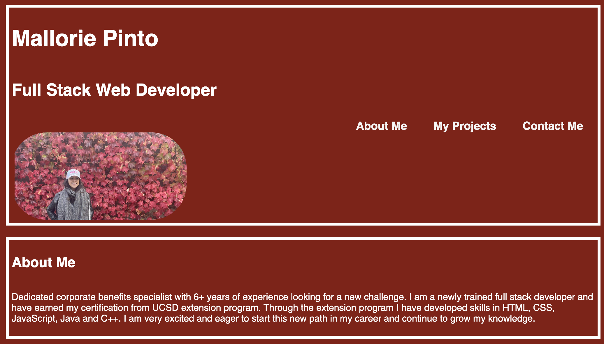

# Mallorie-Portfolio

## Description

I have now built a portfolio for myself to attach to my future resume.  When building the page I have used the skills I have learned in the first two weeks of the bootcamp.  Some of the skills that are demonstrated are CSS styling, CSS positioning, flexbox, media queries, and psudo-classes.  I am hoping to update this page as the class progresses to showcase more of the skills I develop and of course a place to show all my projects.  

## License

No License
